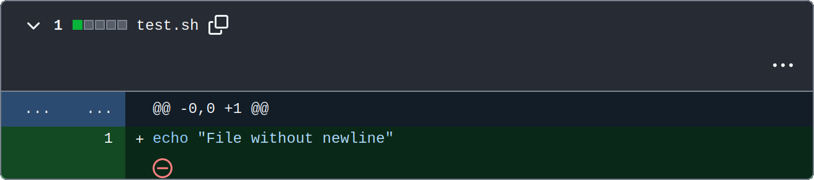

# check-final-newline

A linter checking if final newline is present in the repository text files. It fails on errors reported by GitHub like this:



It runs on an alpine git image and uses standard Unix tools, therefore it's super fast:


This tool now supports an optional feature to automatically commit changes if missing newlines are appended to files. This behavior can be controlled through the GitHub Action input parameter.

## Usage

Create a workflow file in your repository's Workflow folder, like `.github/workflows/check-final-newline.yaml`, and configure it as follows to use the automatic commit feature:

```yaml
name: Check final newline

on:
  pull_request:
    branches: [main]

jobs:
  lint:
    runs-on: ubuntu-latest
    name: Check if all files end in newline
    steps:
      - name: Checkout
        uses: actions/checkout@v4

      - name: Check final newline
        uses: johannesvedder/check-final-newline@main
        with:
        fail_on_missing_newline: 'true'
        commit_changes: 'true'
        commit_branch: ${{ github.head_ref }} # Dynamically set to the head ref of the PR
        commit_name: 'Linter'
        commit_email: 'linter@noreply.github.com'
        commit_message: 'Append newline to end of file'
```

This configuration will trigger a validation of all the text files in your repository and optionally commit changes if enabled.
